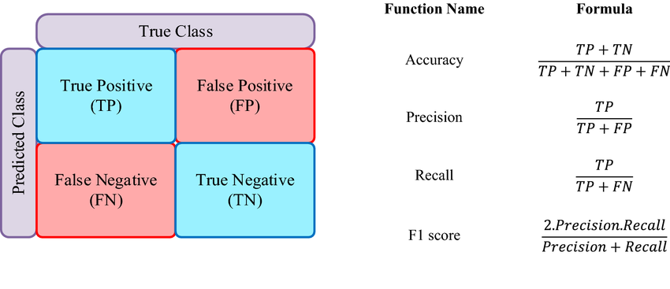

# Laporan Proyek Machine Learning - M.TOFIK HIDAYAT

## Project Overview

Kebanyakan Petani masih banyak yang belum mengetahui tanaman apa yang cocok ditanaman di lahannya. Hal ini disebabkan karena kurangnya pengetahuan petani mengenai kesesuaian lahan dengan persyaratan tumbuh suatu tanaman. Lemahnya tingkat pengetahuan petani dan masyarakat tentang evaluasi kesesuaian lahan menyebabkan tanaman yang dibudidayakan tidak berproduksi optimal, karena syarat yang dibutuhkan tanaman tersebut belum sesuai dengan kondisi lahan yang mendukung pertumbuhan tanaman tersebut. Melihat pentingnya proses pemilihan tanaman berdasarkan kesesuain lahan, sedangkan penentuan pemilihan tanaman masih dilakukan hanya berdasarkan dengan melihat pengalaman petani yang belum teruji. Maka penulis merasa perlu membuat penelitian untuk menentukan tanaman pada lahan berdasarkan kesesuain lahan dan persyaratan tumbuh tanaman. Dengan adanya penelitian ini, maka dapat menentukan tanaman perkebunan yang akan ditanam pada suatu lahan berdasarkan tingkat kesesuaian lahan dan persyaratan tumbuh tanaman yang menjadi alternatif secara tepat, akurat dan dinamis.

Proyek ini bertujuan untuk menganalisis hubungan antara kondisi tanah, faktor iklim, dan rekomendasi tanaman yang optimal menggunakan Agricultural Crop Dataset. Dataset ini mencakup parameter penting seperti kandungan nutrisi tanah (Nitrogen, Fosfor, Kalium), suhu, kelembapan, pH tanah, dan curah hujan. Dengan memanfaatkan teknik Machine Learning, proyek ini dapat menghasilkan model prediksi tanaman yang sesuai untuk ditanam berdasarkan kondisi lingkungan tertentu.
  
  Format Referensi: [PEMILIHAN TANAMAN BERDASARKAN KONDISI LAHAN DAN PERSYARATAN TUMBUH TANAMAN MENGGUNAKAN GABUNGAN METODE AHP DAN TOPSIS](https://jurnal.stmikroyal.ac.id/index.php/jurteksi/article/view/430) 

## Business Understanding

Penggunaan lahan pertanian dan perkebunan saat sekarang masih banyak petani yang belum mengetahui kesesuain dari lahan tersebut. Petani   masih banyak yang belum mengetahui tanaman  apa  yang  cocok ditanaman di lahannya. Hal ini disebabkan karena kurangnya pengetahuan petani mengenai kesesuaian lahan dengan persyaratan tumbuh suatu tanaman. Kesesuaian lahan adalah penggambaran tingkat kecocokan sebidang lahan untuk suatu penggunaan tertentu. Kesesuaian lahan merupakan bagian dari evaluasi lahan. Evaluasi kesesuaian lahan sangat diperlukan dalam  perencanaan penggunaan lahan agar lahan dapat digunakan secara optimal, produktif dan berkelanjutan. Lemahnya tingkat pengetahuan petani dan masyarakat tentang evaluasi kesesuaian lahan menyebabkan tanaman yang dibudidayakan tidak berproduksi optimal, karena syarat yang dibutuhkan tanaman tersebut belum sesuai dengan kondisi lahan yang mendukung pertumbuhan tanaman tersebut.

Melihat betapa pentingnya proses pemilihan lahan yang cocok untuk ditanami beberapa tumbuhan dengan mempertimbangkan segi unsur-unsur dari tanah itu sendiri maka peneliti membantu untuk membuatkan sebuah program kecerdasan buatan guna untuk mengklasifikasi tanah mana yang cocok dengan tumbuhan yang akan di tanam oleh petani itu sendiri, hal ini sangat membantu petani untuk menghindari panen yang kurang maksimal bahkan gagal panen.

### Problem Statements

- Bagaimana model prediksi berbasis data dapat membantu memberikan rekomendasi tanaman yang paling cocok ?
- Bagaimana data ini dapat digunakan untuk memberikan panduan penggunaan sumber daya secara efisien ?

### Goals

- Mengembangkan model prediksi berbasis data yang memberikan rekomendasi tanaman terbaik berdasarkan kondisi tanah (N, P, K, pH) dan faktor lingkungan (suhu, kelembapan, curah hujan).
- Menyediakan panduan berbasis data untuk optimalisasi penggunaan pupuk dan air, berdasarkan analisis kandungan nutrisi tanah dan kebutuhan tanaman tertentu.

Solution statements
- Menggunakan algoritma Supervised Machine Learning seperti K-Nearest Neighbors (KNN), Suport Vector Machine dan Logistic Regression untuk membangun model klasifikasi.
- Mengadaptasi pendekatan sistem rekomendasi berbasis collaborative filtering. Petani atau wilayah yang memiliki kondisi tanah dan lingkungan serupa dianalisis untuk memberikan rekomendasi tanaman berdasarkan data historis.

## Data Understanding
Pada Agricultural Crop Dataset memiliki 1697 baris dan 8 kolom, kolom-kolomnya dirancang untuk memberikan informasi yang relevan tentang kondisi tanah, lingkungan, dan rekomendasi tanaman yang cocok. Dataset bisa diakses pada link berikut : [KAGGLE Agricultural Crop Dataset](https://www.kaggle.com/datasets/agriinnovate/agricultural-crop-dataset/data).

Berikut penjelasan dari setiap kolom utama::  

Variabel-variabel pada Agricultural Crop Dataset adalah sebagai berikut:
- N (Nitrogen) : Tingkat kandungan Nitrogen di tanah.
- P (Phosphorus) : Tingkat kandungan Fosfor di tanah.
- K (Potassium) : Tingkat kandungan Kalium di tanah.
- Temperature (Suhu) : Suhu rata-rata lingkungan (dalam derajat Celcius).
- Humidity (Kelembaban) : Deskripsi: Persentase kelembapan udara.
- PH (Derajat Keasaman Tanah) : Nilai pH tanah.
- Rainfall (Curah Hujan) :  Curah hujan rata-rata (dalam mm).
- Label : Rekomendasi tanaman yang cocok untuk ditanam berdasarkan parameter lainnya.
Peneliti sebelum melakukan analisis lebih lanjut maka peneliti melakukan pendekatan antara feature dengan target sebagai berikut : 
- Melakukan beberapa analisa dan visualisasi terhadap kolom target.
- Melakukan analisa terhadap kolom categorical dengan target.
- Melakukan analisa terhadap kolom numerical dengan target.
- Melakukan analisis korelasi dari semua kolom dengan target.
## Data Preparation
Data Preparation adalah tahap penting dalam proses pengolahan data untuk memastikan data siap digunakan dalam analisis atau pembuatan model. Tahap ini melibatkan berbagai proses transformasi dan pembersihan data mentah agar menjadi lebih berkualitas, relevan, dan mudah diolah. Data preparation sering dianggap sebagai fondasi keberhasilan dalam proyek data science atau machine learning.

1. Handling Missing Value
Pada tahap ini, langkah-langkah yang dilakukan adalah memastikan tidak ada data kosong (missing values) dalam dataset. Jika ditemukan nilai yang hilang:

Imputasi Median digunakan untuk kolom numerik seperti suhu, kelembapan, atau pH, agar nilai pengganti tidak terlalu memengaruhi distribusi data.

2. Handling Duplicated
Pada tahap ini, langkah-langkah yang dilakukan adalah memastikan tidak ada data yang duplicated dalam dataset. Jika ditemukan nilai yang duplicated maka akan dilakukan drop rows pada data yang duplicated dan ambil data yang pertama atau menggunakan parameter keep='first' pada fun drop duplicated.

3. Normalisasi Data
Data numerik seperti Nitrogen, Fosfor, Kalium, suhu, kelembapan, pH, dan curah hujan dinormalisasi menggunakan MinMaxScaler. Normalisasi memastikan semua fitur memiliki skala yang sama sehingga tidak ada fitur yang mendominasi perhitungan.

4. Split Data
Dataset dibagi menjadi train set dan test set dengan proporsi 80:20 menggunakan train_test_split. Langkah ini penting untuk mengevaluasi performa model pada data yang belum pernah dilihat sebelumnya.

Pada tahap ini bermanfaat sebagai berikut :  
- Memastikan tidak ada nilai yang hilang (missing values).
- Menstandarkan skala data, seperti suhu, kelembapan, dan kandungan nutrisi tanah, menggunakan normalisasi atau standardisasi.
- Menangani data yang outlier untuk meningkatkan akurasi prediksi.
- Menanggani data yang duplicated.
- Split data yang membagi data 80% train dan 20% test.
## Modeling
Tahap Modeling adalah proses dalam machine learning di mana model atau algoritma dilatih untuk membuat prediksi atau keputusan berdasarkan data yang telah disiapkan. Tahap ini sangat penting karena model yang dibangun menentukan akurasi dan efektivitas solusi yang dihasilkan.

Model 1: K-Nearest Neighbors (KNN)
Cara Kerja
KNN bekerja dengan mencari k tetangga terdekat dari sebuah titik data berdasarkan metrik jarak (umumnya Euclidean). Prediksi ditentukan berdasarkan mayoritas kelas dari tetangga tersebut.

Parameter:
1. n_neighbors: Menentukan jumlah tetangga terdekat yang digunakan untuk prediksi.
2. weights: Bobot yang diberikan pada tetangga, seperti uniform atau distance.
3. p: Menentukan jenis metrik jarak (p=2 untuk Euclidean, p=1 untuk Manhattan).

- Kelebihan K-Nearest Neighbors (KNN) : 
    * Mudah diimplementasikan dan dimengerti karena hanya menggunakan kedekatan jarak untuk klasifikasi.
    * Tidak membuat asumsi tentang distribusi data, cocok untuk data yang kompleks atau tidak linier
    * Sangat efektif untuk dataset kecil yang memiliki pola jelas.
- Kekurangan Nearest Neighbors (KNN) : 
    * Karena harus menghitung jarak untuk setiap titik data dalam dataset, performanya menurun pada dataset besar.
    * Akurasi menurun ketika jumlah fitur meningkat (curse of dimensionality).
    * Perlu normalisasi atau standarisasi data agar hasilnya akurat.

Model 2: Support Vector Machine (SVM)
Cara Kerja
SVM memanfaatkan hyperplane untuk memisahkan data menjadi dua kelas dengan margin terbesar. Menggunakan kernel, SVM dapat memetakan data non-linear ke ruang dimensi yang lebih tinggi.

Parameter:
1. kernel: Menentukan fungsi kernel seperti linear, RBF, atau polynomial.
2. C: Parameter regularisasi yang mengontrol trade-off antara margin besar dan klasifikasi yang benar.
3. gamma: Mengontrol pengaruh titik data individu dalam kernel RBF.

- Kelebihan Support Vector Machines (SVM):
    * Kernel trick memungkinkan SVM menangani data yang tidak linier dengan memetakannya ke dimensi yang lebih tinggi.
    * SVM dapat bekerja dengan baik pada dataset dengan banyak fitur.
    * Cocok untuk klasifikasi biner atau multi-kelas, dan mampu memberikan solusi optimal pada masalah klasifikasi yang kompleks.
- Kekurangan Support Vector Machines (SVM):
    * Pemilihan kernel dan penyesuaian parameter (seperti C dan gamma) sangat mempengaruhi kinerja model.
    * Kompleksitasnya membuat SVM kurang cocok untuk dataset besar.
    * Hasil model sulit untuk dijelaskan karena bekerja pada dimensi yang lebih tinggi.
    
Model 3: Logistic Regression
Cara kerja
Logistic Regression adalah algoritma klasifikasi yang menggunakan fungsi logit (sigmoid) untuk memodelkan probabilitas data ke dalam salah satu dari dua kelas. Model ini bekerja dengan menghitung kombinasi linear dari fitur, kemudian mengubahnya menjadi nilai probabilitas menggunakan fungsi sigmoid. Keputusan klasifikasi dilakukan berdasarkan threshold (biasanya 0.5).

Parameter : 
1. penalty: Jenis regularisasi yang digunakan, seperti l1, l2, atau elasticnet, untuk mencegah overfitting.
2. C: Parameter invers dari strength regularisasi; nilai yang lebih kecil berarti regularisasi lebih kuat.
3. solver: Algoritma optimasi yang digunakan untuk menemukan parameter terbaik, seperti liblinear atau saga.
4. max_iter: Jumlah iterasi maksimum yang diizinkan selama proses pelatihan.

- Kelebihan Logistic Regression:
    * Mudah diimplementasikan dan diinterpretasikan.
    * Cocok untuk data dengan jumlah fitur kecil.
    * Tidak membutuhkan banyak daya komputasi.
- Kekurangan Logistic Regression:
    * Tidak cocok untuk data dengan hubungan non-linear.
    * Membutuhkan preprocessing yang baik agar hasil akurat.

## Evaluation
Metrik Evaluasi
Pada proyek ini, metrik evaluasi utama yang digunakan adalah F1-Score. Pemilihan F1-Score didasarkan pada kebutuhan untuk memastikan keseimbangan antara precision (ketepatan) dan recall (cakupan), yang penting dalam konteks sistem rekomendasi adapun rumus F1-score sebagai gambar dibawah :

* Precision: Kemampuan model untuk memprediksi hanya tanaman yang relevan.
* Recall: Kemampuan model untuk memprediksi semua tanaman yang cocok.
* Accuracy: Digunakan sebagai metrik tambahan untuk memberikan gambaran umum kinerja model.

Hasil Evaluasi
Berikut adalah hasil evaluasi dari masing-masing model:

Model Support Vector Machine (SVM) menunjukkan performa terbaik, dengan F1-Score mencapai 99%. Ini menunjukkan bahwa model dapat secara konsisten merekomendasikan tanaman yang paling relevan berdasarkan parameter tanah dan lingkungan.

### Analisis Dampak terhadap Business Understanding

1. Apakah Problem Statement Terjawab? (Bagaimana model prediksi berbasis data dapat membantu memberikan rekomendasi tanaman yang paling cocok?) Ya. Sistem rekomendasi berbasis Machine Learning ini dapat membantu petani memilih tanaman yang paling cocok untuk ditanam berdasarkan kondisi tanah dan faktor lingkungan.

2. Apakah Berhasil Mencapai Goals?
* Goal 1: Model prediktif berhasil memberikan rekomendasi tanaman berdasarkan kondisi lingkungan.
* Goal 2: Dengan data yang digunakan, model memungkinkan efisiensi sumber daya seperti pupuk dan air dengan memberikan panduan berbasis data.

3. Apakah Solusi Berdampak?
* Dampak pada Petani: Dengan rekomendasi yang lebih akurat, petani dapat meningkatkan produktivitas dan hasil panen serta mengurangi risiko gagal panen.
* Dampak pada Sumber Daya: Solusi ini memungkinkan penggunaan pupuk dan air yang lebih efisien, mengurangi biaya operasional, dan mendukung keberlanjutan pertanian.
* Dampak Jangka Panjang: Memberikan edukasi kepada petani mengenai evaluasi kesesuaian lahan secara ilmiah, yang dapat meningkatkan kualitas pertanian secara keseluruhan.

### Kesimpulanm
Model SVM dipilih sebagai model terbaik karena memiliki performa tertinggi berdasarkan F1-Score. Model ini berhasil mencapai tujuan utama proyek, yaitu memberikan rekomendasi tanaman yang sesuai berdasarkan kondisi lahan dengan angka mencapai F1-score 99% . Dengan demikian, solusi ini berdampak signifikan dalam menjawab masalah dan memenuhi kebutuhan para petani, sekaligus membuka peluang untuk integrasi teknologi berbasis Machine Learning di sektor pertanian.

